# Connection Status Guide

NoLimitConnect supports both direct peer-to-peer connections and relay-assisted connections.  
This guide explains how connectivity works and how to interpret the status indicator bars shown at the top of the application.

---

# 📡 How NoLimitConnect Connectivity Works

NoLimitConnect operates in two modes depending on whether your device can accept incoming connections.

## **1. Direct Peer-to-Peer (P2P) Mode**
If your device has an **open port**, other devices can connect to you directly.

**Advantages:**
- Fastest data transfer  
- Lowest latency  
- Ideal for hosting chat rooms, groups, or random connect  
- No relay dependency  

---

## **2. Relay-Assisted Mode**
If your device **cannot open a port**, NoLimitConnect automatically uses a **relay host**.

Relays allow full communication even if:
- You are behind strict NAT  
- Your ISP uses carrier-grade NAT  
- Port forwarding is not possible  
- Firewall rules block inbound traffic  

**Important:** You can still communicate socially in relay mode,  
but **you cannot host** unless your own port is open.

---

# 🖼 Network Traffic Diagram

NoLimitConnect distinguishes two kinds of "host": the small set of always-on **Network Host**
infrastructure services (a directory plus a connection tester — see
[Network Hosts](technical/README-NETWORK-HOSTS.md)) and **User Host Devices**, which are just
regular users who chose to host a Group, Chat Room, or Random Connect service from their own
machine.

```mermaid
flowchart TB
    subgraph NH["Network Host Device"]
        direction LR
        CTS["Connection Test Service<br/><small>may be hosted on a different device</small>"]
        HLS["Host List Service"]
        OPT["Optional Host Services<br/><small>Group Host · Chat Room Host · Random Connect Host</small>"]
    end

    UHD["User Host Device<br/><small>may host any or all of:</small><br/>Group Host · Chat Room Host · Random Connect Host"]
    UA["User A"]
    UB["User B"]

    UA -.->|"1. Test open port"| CTS
    UB -.->|"1. Test open port"| CTS
    UHD -.->|"1. Test open port"| CTS

    UHD ==>|"2. Host announce"| HLS
    UA ==>|"2. Host list query"| HLS
    HLS ==>|"2. Host list query"| UB

    UA <-->|"3. Online status / relayed data"| UHD
    UHD <-->|"3. Online status / relayed data"| UB

    UA <==>|"4. Direct P2P connection"| UB

    classDef hostBox fill:#173620,stroke:#2ecc71,stroke-width:2px,color:#eafff1
    classDef optBox fill:#3a2a10,stroke:#ef8f1e,stroke-width:2px,stroke-dasharray:5 3,color:#ffe9c7
    classDef userBox fill:#22262e,stroke:#8a94a6,stroke-width:2px,color:#e8ecf1

    class CTS,HLS,UHD hostBox
    class OPT optBox
    class UA,UB userBox

    style NH fill:#0e2a13,stroke:#2ecc71,stroke-width:2px

    linkStyle 0 stroke:#9b8cff,stroke-width:1.5px,stroke-dasharray:4 3
    linkStyle 1 stroke:#9b8cff,stroke-width:1.5px,stroke-dasharray:4 3
    linkStyle 2 stroke:#9b8cff,stroke-width:1.5px,stroke-dasharray:4 3
    linkStyle 3 stroke:#2f7dd1,stroke-width:3px
    linkStyle 4 stroke:#2f7dd1,stroke-width:3px
    linkStyle 5 stroke:#2f7dd1,stroke-width:3px
    linkStyle 6 stroke:#ef8f1e,stroke-width:3px
    linkStyle 7 stroke:#ef8f1e,stroke-width:3px
    linkStyle 8 stroke:#2ecc71,stroke-width:4px
```

**Legend:**

1. **Dashed purple** — Test internet connection for an open port, checked against the Connection Test Service.
2. **Blue** — Host announce (a User Host Device registering itself with the Host List Service) and host list query (a client asking which hosts are available).
3. **Orange** — User online status and relayed user data, forwarded through a User Host Device when a direct connection isn't available.
4. **Green** — Direct, person-to-person connection data traffic once both peers can reach each other.

> A static copy of the original diagram is still available at
> [`assets/network/NoLimitConnectNetworkTraffic.png`](assets/network/NoLimitConnectNetworkTraffic.png).

---

# 📶 Connection Status Indicator Bars

These icons indicate your current network test state and connectivity level.

| Icon | Meaning |
|------|---------|
|  | Internet detected — beginning network check |
|  | Connection Test service available |
|  | Network Host service is available |
|  | Testing if you have an open port |
|  | **Using Relay** — port is *not open*, relay required |
|  | **Direct Mode** — port open, direct connections available |
|  | **Hosting (Direct)** — hosting services with open port |

---

# 📒 Beginner-Friendly Explanation

When you open NoLimitConnect, the app checks whether you can accept incoming connections.

- **Yellow bars** → The app is *testing* your network and NAT configuration  
- **Orange bars** → You are online but in **relay mode** (your port isn’t open)  
- **Green bars** → Your port is **open**, and you can host or connect directly  

Even if your port cannot be opened, NoLimitConnect still works — the host handles relaying automatically.

---

# 📘 Technical Explanation (For Advanced Users)

## NAT & Port Forwarding
Most users are behind:
- Home NAT  
- ISP-level NAT  
- Firewalls  

These block unsolicited inbound connections.

NoLimitConnect therefore:
1. Determines your NAT type  
2. Tests if inbound TCP traffic can reach you  
3. Switches to relay mode if necessary  

---

## Direct Mode (Green)
Direct mode is active when:
- UPnP succeeds  
- Manual port forwarding is configured  
- NAT supports inbound mappings  
- Firewalls are not blocking  

Direct mode is required to host.

---

## Relay Mode (Orange)
Relay mode activates when:
- Your port is closed  
- You are behind symmetric NAT  
- Your ISP uses CGNAT  
- Firewalls block inbound requests  

Traffic flows:

The **host** relays data for users without open ports.

---

## Hosted Direct Mode
Hosting always requires:
- A stable public IP  
- An open port  

If your port is closed:
- You cannot host  
- You can only join existing hosts  
- Traffic to other users must pass through the host's relaying  

---

# 🔧 Troubleshooting Port Status

If you want direct mode or hosting ability:

- Enable UPnP on your router  
- Port-forward your assigned NoLimitConnect port  
- Ensure firewalls allow incoming TCP on that port  
- Avoid mobile hotspots — most block inbound traffic  
- Consider Hide.me VPN (supports automatic port forwarding)  

